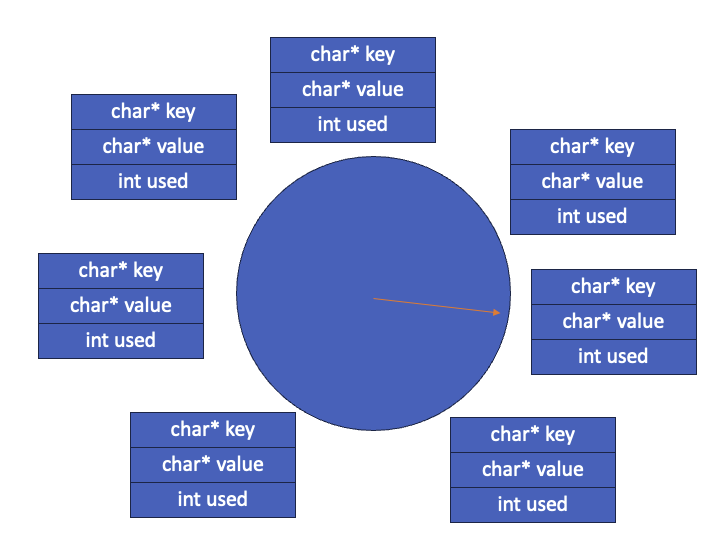

# Report
## Overview
In this assignment, I finished data partitioning in separate nodes, forwarding the request to other nodes, multithreading and caching using an algorithm similar to clock algorithm to remove cache when it is full.

## Data partitioning and index building
After forking from the parent process, each node of the child process connect with the parent process in `request_partition` function using the parent port name saved in `PARENT_PORT` variable. After getting the data partitioned by the parent process, the size of the partition is updated to `partition.db_size` variable and allocate a pointer of the size to `partition.m_ptr`. Then read in the actual binary data part using `Rio_readnb` function to store it in `partition.m_ptr`. Finally call the `build_hash_table` to build the index hash table in memory of the partition and close the file descriptor to connect with the parent process.

## Query serving and requests forwarding
In the `thread` function, an if condition will check the request is a one-term query or a two-term query and call the `get_one_result_string` or `get_two_result` separately.

### One-term search
In one-term cases, `get_one_result_string` will check whether there is the data requested in the index hash table of the current node. If there exits, return the result. If not, check if there is a copy in the cache of the node. If yes, return the result. If not, sending the request to the node that should store the data using the partitioning method. However, before forwarding the request, the id should be checked. It should not be the current node id itself, or it will fall into a infinite loop. 

Once sure that the id does not equal the node itself, connect with the potential node and get the result.

Another `is_found` function will check whether the returned string is the same with the not found string "<key> not found" and return the result.

If still not found, return NULL, or return the found data from other nodes and call `write_cache` function to write a copy to the cache of the current node.

In the `thread` function, check whether the result is NULL. If yes, call a helper function `generate_not_found` to generate a string containing the not-found message and return to the client; or return the result. Finally, free the not-found string or the result string to ensure memory safety.

### Two-term search
In `get_two_result_string`, the one-term search functions will be called to search the two keys separately. Thus, two term search will not care about forwarding issues as they are implemented in the function already. After getting separate result of the two keys, generate corresponding result, including found cases and not-found cases and return.

In `thread` function, return the result directly.

## Multithreading
In `node_serve` function, thread pool is created using `sbuf` package. This is a model similar to producer-consumer model. We created first some threads that can be reused. Then after accepting connection with the client, insert the request to a queue. The threads will consume the request in the queue and block itself after finishing the serving if the queue is empty and keep waiting for new requests to be inserted; or simple consume another request stored in the queue. 

The thread pool avoid re-generating multiple threads and keep the number of threads in a acceptable range compared with the traditional method of generating one thread a time when accepting one connection.

## Caching
### Cache saving
I created two structs in `cache.h`. One is the structure of the cache node which contains the following properties: `char* key` to store the key, `char* value` to store the value and `int used` to store the used times of the current cache nodes. Another struct is the cache struct with an array of 512 cache nodes, cache numbers, time index to point to the current cache node to check when the cache is full, and the current size of the cache.

### Cache reading and writing
The cache reading and writing is a model of reader-writer. In reading phase, it is a reader to look up the key in the cache and add the used time of the current cache node by 1 and return the result found or NULL if not found.

#### Cache reading
In `lookup_cache` function, first lock  `mutex` to ensure thread safety to add read count `readcnt`. For the first reader, lock `w` to ensure there is no writer at the same time. Then unlock the mutex. 

After getting the result of the key requested, lock mutex again to ensure there is only one thread change the read count and update the used times if the data has been found. For the reader last out, unlock `w`. Finally unlock `mutext` and return the result.

As the `w` is locked all the time there exit readers, this ensures that there will be no writer if there is at least one reader looking up the data.

#### Cache writing
In `write_cache` function, first check if the cache is full (the current size equals to the capacity). If full, do a clock similar algorithm to remove one cache.

The time index in the cache struct points to one cache node. Check whether the node's used times equals 0, if so remove it and store the new cache in this slot and point the time index to the next item. Or minus the used times by 1 and point the pointer to the next item until found a node's used time variable is 0.

This to some extend ensures that the node to remove has somewhat low frequency of looking up.

If the cache is not full, just saved the key and value to the free slot of the array in the cache struct.

As the `w` is locked at the beginning and unlocked at the end, there will be only one writer at the same time accessing the cache to update.

### Limitations
#### High searching time
As the nodes are stored in an array, it will spend O(n) time to look up the key each time. I tried to combine the algorithm with hash table to reduce searching time to O(1) but found more issues to solve and failed to finish.

#### Not real least frequency removal algorithm
The clock similar algorithm is not an absolute lest frequency removal algorithm as the used times will be decreased only when the pointer of the clock of points to the node. In actual cases, the pointer of the clock might finish one round in many times' removals or spend more than one rounds' iteration to decrease all the used times to 0 to finally find the node to remove.